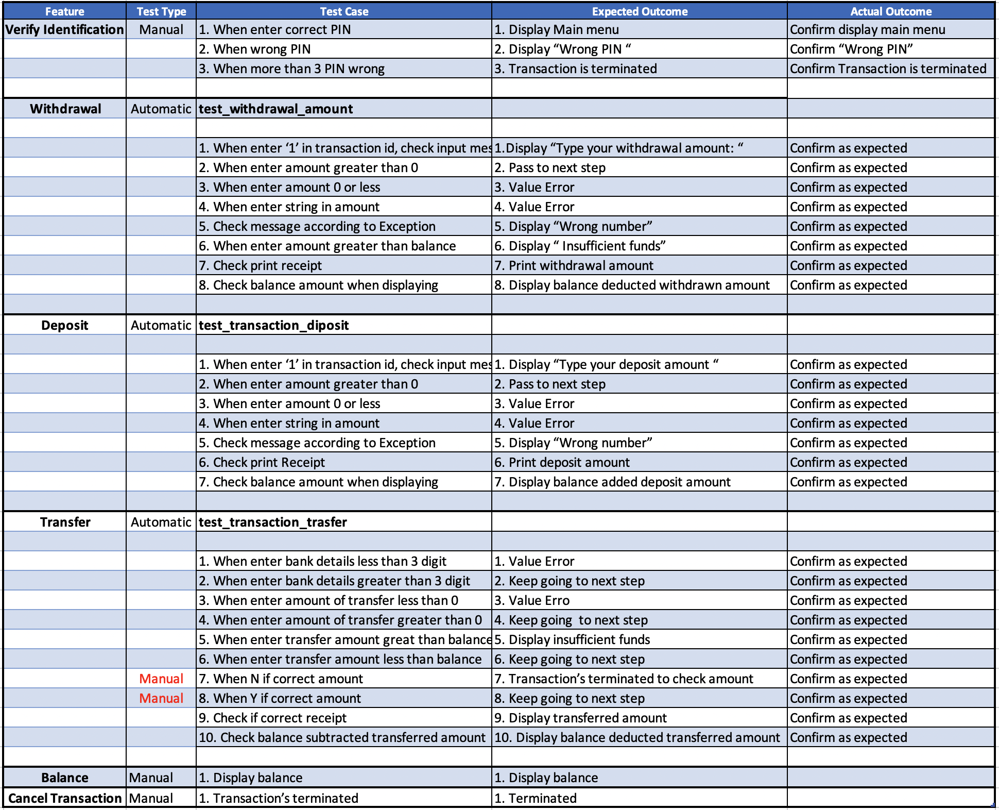

# ATM application
## The purpose of ATM application
Nowadays, there are many ways to provide convenience to customers when doing bank transactions, 
such as Internet banking, phone banking, and credit card etc. Among them, ATM (Automatic Teller Machine) is 
one of the oldest ways for bank transactions.

This computer, which allows customers to conveniently manage their funds, provides balance checking, withdrawal and deposit, and remittance functions. Some countries offer services such as cash advance services and can even buy stamps.

When I started this project, this ATM device came to mind when I thought of terminals while doing various brainstorming. Assuming that this brand new ATM machine with a new transfer feature is installed at a virtual bank called Cooper Bank. ATM features of withdrawal, deposit, transfer, and balance check are implemented at this application.

I hope this application will be a good opportunity for young children and the elderly who are not familiar with ATM operation to learn how to operate it.

----

## The link of Github
[ATM application](https://github.com/Henry229/CA_T1A3_ATM)

----

## Style Guide
The style guide I adhered to when creating this application is python's pep8 style. Source layouts such as indentation and line length refer to the coding convention presented in pep8. Also, the naming of variables, functions, and classes uses PascalCase, snake_case, and camelCase, which are widely used in the Python community.

Also, in case I missed this coding convention when coding, I received the guide of pylint, one of the vscode extensions, and the help of autopep8 in the Python package. This tool is very useful because it automatically enforce the coding conversion of pep8 and prevents my common mistakes in advance. By doing this, I can avoid inconsistency that mess my source code and increase your coding productivity by increasing readability.

Reference: https://peps.python.org/pep-0008/

----

## Features
The ATM application has a total of 6 features that is features of real ATM such as verifying Identification, withdraw, deposit, transfer, balance check, and cancel transactions. Also, I obtained educator’s approval. 

https://discord.com/channels/738633600701825117/1019579052765491210 

### Verifying Identification
All transactions will begin with this transaction. If the client has his/her own card and right PIN this application will be shown main menu screen. the client has three chances to enter your PIN number correctly.

### Withdrawal
This feature is literally able to withdraw money from your account if you have enough money as much as you can take. To do this, This feature will check the balance first. If a client has enough money you will be given money. Also, you can get a receipt when you complete the transaction. The client makes sure the balance is deducted as much as withdraws.

### Deposit
A client can deposit the cash into his/her account. When this transaction is complete, print the balance on the receipt and also check it on the screen. Likewise, The client can get receipt and confirm the balance on the screen. The client can check the added amount of the account.

### Transfer
A client can deposit the cash into his/her account. When this transaction is complete, print the balance on the receipt and also check it on the screen. Likewise, The client can get receipt and confirm the balance on the screen. The client can check the added amount of the account.

### Check balance
The client can check the balance by choosing this transaction. The client can see how much money is left in his/her account.

### Cancel Transaction
The transaction will be terminated when choosing this transaction.

----

## Implementation Plan
The plan of project is an integral part of proceeding project. Efficient project management can be achieved by keeping the deadlines in the plan and proceeding with the project according to the processing priorities. I am using a project management tool called Trello for efficient project management, and I am dividing the project into **To Do**, **Processing**, **Pending**, and **Done** based on project processing and working on it according to work priority and deadline.
You can track my ATM project below link.

### [Trello](https://trello.com/b/bg9XvBXU/t1a3-atm)

----

## Flow Chart
We often use the flow chart to understand the application structure at a glance. It helps to understand the overall flow of the application by identifying where to use conditional statements and loop statements in the application.

----

### Testing

The ATM application I made has a total of six features. A unit test is conducted to verify that the function of each feature works accurately. So I made a total of six test suites by this feature. 

**outline of the testing procedure.** 

When I did the test, I conducted the test by mixing the **automatic tes**t and the **manual tests**. The automatic test targets are withdrawal, deposition, and transfer feature among features. For each feature, the test module is `test_transaction_withdraw`l, `test_transaction_deposit`, and `test_transaction_transfer`, which can be found in the code source. The test was conducted with pytest according to the test cases below, and the test results were also confirmed.

The target of the manual test is `verify identification`, `balance check`, and `cancel transaction`. It was tested whether the main function of each feature was properly implemented and whether the message was properly output when meet specific condition.

The test suit of each feature is as follows

